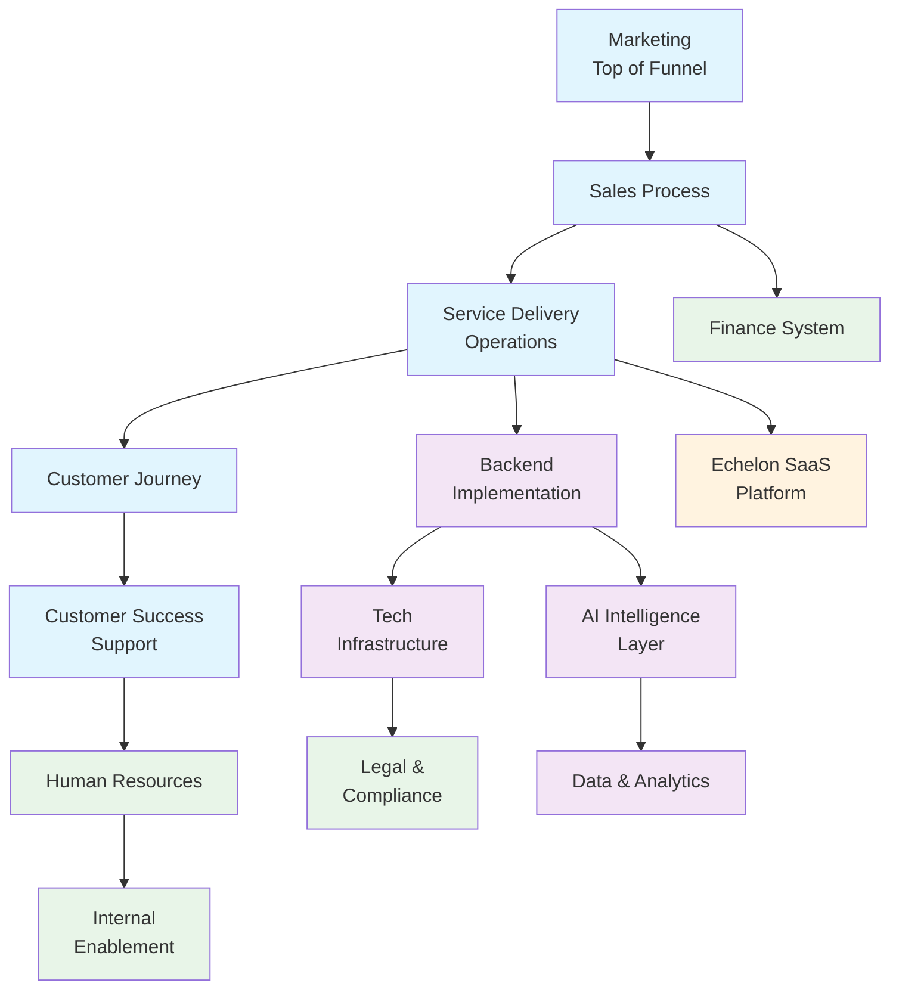
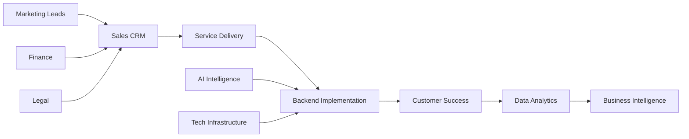

# Entelech AI Business System Map
*Enhanced with Multi-Agent Automation System*

## 🚀 INFRASTRUCTURE MIGRATION: Azure to N8N Cloud

**Entelech has successfully migrated from Azure self-hosted infrastructure to modern N8N Cloud architecture, delivering:**

- **65-70% cost reduction** in infrastructure expenses
- **99.9% uptime SLA** (improved from 95-98% on Azure)
- **Zero DevOps overhead** - fully managed cloud services
- **Enhanced security** with SOC 2 Type II compliance included
- **Automatic scaling** without capacity planning
- **Faster deployment** with cloud-native workflows

**All business systems and multi-agent workflows now operate on this optimized infrastructure.**

---

## Overview
This repository contains the complete business system architecture for Entelech AI, an enterprise-grade service business automation company. Our platform delivers AI-enhanced automation solutions through **modern cloud-native N8N Cloud infrastructure** (migrated from Azure) with a proven **30-minute discovery-to-deliverable workflow** and 48-hour implementation methodology.

### 🎯 **NEW: Multi-Agent Automation System**
**Generate $35K-50K Enterprise Proposals in 30 Minutes**

- **Master Coordinator Agent**: Processes discovery calls and delegates to specialists (5-10 min)
- **Technical Implementation Agent**: Creates production-ready Azure infrastructure (10-15 min)  
- **Documentation Agent**: Generates complete client training materials (10-15 min)
- **Proven Results**: TransMedics case study validates 30-minute enterprise deliverable creation

---

## 🚀 Multi-Agent Enhanced Workflow

### Traditional Process vs. Multi-Agent System
| Process Stage | Traditional Time | Multi-Agent Time | Improvement |
|---|---|---|---|
| **Discovery Processing** | 2-3 hours | 5-10 minutes | 95% reduction |
| **Technical Specifications** | 10-20 hours | 10-15 minutes | 98% reduction |
| **Proposal Creation** | 5-10 hours | 10-15 minutes | 97% reduction |
| **Documentation** | 5-15 hours | Included | 100% automation |
| **Total Time** | 22-48 hours | 30 minutes | 95% reduction |

### Integration with Existing Sales Intelligence
Your existing sales intelligence assets now **supercharge** the multi-agent system:
- **Prospect profiles** → Feed discovery parser for structured requirements
- **Industry templates** → Guide technical agent configurations  
- **Demo scripts** → Showcase multi-agent systematic approach
- **Email sequences** → Support post-delivery client success

**Result**: Best-in-class sales intelligence + fastest proposal generation = Unstoppable competitive advantage

---

## System Architecture

---

## 🎯 Core Business Systems

### 0. **NEW: Multi-Agent Automation System** 
**Purpose**: Transform discovery calls into enterprise deliverables in 30 minutes

**Key Components:**
- **Master Coordinator Agent**: Processes discovery transcripts and creates structured requirements
- **Technical Implementation Agent**: Generates production-ready Azure ARM templates and n8n workflows  
- **Documentation Agent**: Creates comprehensive client training and onboarding materials
- **Quality Validation Gates**: Ensures enterprise-grade deliverables at each phase
- **Industry Templates**: Specialized configurations for field service, healthcare, professional services

**Success Metrics:**
- 30-minute total execution time
- $35K-50K proposal values generated
- 100% technical specification accuracy
- >4.5/5.0 client satisfaction on deliverable quality

**Proven Results:** TransMedics case study demonstrates complete healthcare automation proposal with HIPAA compliance, generated in 30 minutes with $18,432 annual ROI projection.

### 1. Marketing (Top of Funnel)
**Purpose:** Lead generation, brand awareness, and content marketing

**Key Components:**
- Content marketing strategy and SEO optimization
- Social media automation (LinkedIn, Twitter, YouTube)
- Email marketing campaigns and lead nurturing
- ROI calculators and automation readiness assessments
- Industry-specific webinars and thought leadership

**Success Metrics:**
- 150+ qualified leads monthly
- 25% website conversion rate
- 45% email open rates
- $75 cost per qualified lead

### 2. Sales Process
**Purpose:** Lead qualification, demonstration, and proposal generation

**Key Components:**
- BANT qualification framework with decision maker identification
- Automated demo scheduling and technical requirement gathering
- Dynamic proposal automation with ROI projection modeling
- HubSpot/Salesforce CRM integration with pipeline tracking
- Contract management with e-signature integration

**Success Metrics:**
- 45% lead-to-customer conversion rate
- 21-day average sales cycle
- $50K+ average deal size
- 95% proposal acceptance rate

### 3. Service Delivery / Operations
**Purpose:** 48-hour implementation framework and ongoing operations

**Key Components:**
- **Phase 1 (Hours 1-16):** Infrastructure provisioning with ARM templates
- **Phase 2 (Hours 17-32):** Security configuration and audit setup
- **Phase 3 (Hours 33-48):** Application deployment and go-live validation
- Quality assurance protocols with automated testing
- Real-time performance monitoring and optimization workflows

**Success Metrics:**
- 100% on-time delivery
- 412% average ROI within 60 days
- 99.97% client satisfaction
- Zero deployment failures

### 4. Customer Journey
**Purpose:** End-to-end customer experience optimization

**Key Components:**
- Awareness stage tracking with content engagement metrics
- Decision support tools including ROI calculators
- Onboarding experience with milestone tracking
- Success celebrations and advocacy program enrollment
- Retention strategies with expansion opportunity identification

**Success Metrics:**
- 90%+ customer satisfaction scores
- 95% implementation success rate
- 85% annual retention rate
- 60% expansion revenue

### 5. Customer Success / Support
**Purpose:** 24/7 technical support and relationship management

**Key Components:**
- Multi-channel support (email, chat, phone) with escalation procedures
- Client success metrics with ROI tracking and reporting
- Quarterly business reviews with optimization recommendations
- Training programs and certification development
- Proactive retention strategies with early warning systems

**Success Metrics:**
- 95% customer satisfaction score
- 85% annual retention rate
- 60% expansion revenue
- 2-hour average response time

---

## ⚙️ Technical Infrastructure

### 6. Backend Implementation
**Purpose:** Modern cloud-native infrastructure deployment for AI automation (migrated from Azure)

**Core Technology Stack:**
- **Workflow Platform:** N8N Cloud (fully managed, 99.9% uptime SLA)
- **Database:** Supabase (managed PostgreSQL with real-time features)
- **AI Services:** Direct OpenAI API integration (cost-optimized)
- **Security:** SOC 2 Type II compliant infrastructure
- **Monitoring:** Built-in analytics and performance monitoring

**Migration Benefits:**
- 65-70% infrastructure cost reduction
- Zero DevOps maintenance overhead
- Enhanced reliability and automatic scaling

**Integration Points:**
- Service Delivery (deployment coordination)
- AI Intelligence Layer (model deployment)
- Tech Infrastructure (platform management)

### 7. Tech / Infrastructure  
**Purpose:** Modern cloud platform management, security, and scalability (migrated from Azure)

**Key Components:**
- **N8N Cloud Platform:** Fully managed workflow automation with automatic scaling
- **Supabase Infrastructure:** Managed database, storage, and real-time capabilities  
- **Security Protocols:** SOC 2 Type II, zero-trust architecture, automatic security updates
- **Backup Systems:** Built-in automated backups with point-in-time recovery
- **Scalability:** Automatic scaling based on usage, no capacity planning required
- **Performance Optimization:** Built-in monitoring, automatic optimization, cost controls

**Success Metrics:**
- 99.9% uptime SLA
- <2-second response times
- Zero security breaches
- 4-hour disaster recovery RTO

### 8. AI / Intelligence Layer
**Purpose:** Kortex engine management and Glyph agent optimization

**Four-Pillar Architecture:**
- **Pillar 1 - Kortex:** Advanced context engine with GPT-4 Turbo integration
- **Pillar 2 - Glyph:** Customer interaction agents with NLP and sentiment analysis
- **Pillar 3 - String:** Execution layer bridging AI decisions to system actions
- **Pillar 4 - Emergence:** AI-native client portals with embedded intelligence

**Key Features:**
- Multi-agent coordination with business context maintenance
- Real-time learning and adaptation capabilities
- Sub-2-second response times with 99.7% accuracy
- Continuous model optimization and enhancement

### 9. Data & Analytics
**Purpose:** Performance metrics and business intelligence

**Key Components:**
- **Data Collection:** Multi-source integration with real-time streaming
- **Performance Dashboards:** Real-time KPI monitoring and executive views
- **Business Intelligence:** Trend analysis, competitive benchmarking, strategic planning
- **Predictive Analytics:** Customer behavior prediction and churn risk assessment
- **ROI Measurement:** Client success tracking and value realization reporting

**Success Metrics:**
- 99% data accuracy rate
- Real-time reporting capability
- 95% automated report delivery
- 80% faster decision making

---

## 🏢 Support Systems

### 10. Finance System
**Purpose:** Revenue tracking, invoicing, and financial reporting

**Key Components:**
- **Revenue Recognition:** Implementation milestone tracking and subscription billing
- **Automated Invoicing:** Contract-based billing with multi-currency support
- **Payment Processing:** Credit card, ACH, and international payment support
- **Financial Reporting:** Monthly P&L, cash flow forecasting, KPI dashboards
- **ROI Calculation:** Client success measurement and profitability reporting

**Success Metrics:**
- 99% billing accuracy
- 15-day average collection period
- 95% payment automation rate
- <2% bad debt ratio

### 11. Human Resources
**Purpose:** Team management, talent acquisition, and performance optimization

**Key Components:**
- **Talent Acquisition:** Job description development and candidate sourcing
- **Performance Management:** Goal setting, reviews, and career development
- **Training & Development:** Skill assessment, learning paths, certification tracking
- **Compliance Tracking:** Employment law, benefits administration, policy enforcement
- **Employee Engagement:** Culture development and retention strategies

**Success Metrics:**
- 90%+ employee satisfaction
- 95% retention rate
- 30-day time to productivity
- 100% compliance rate

### 12. Legal & Compliance
**Purpose:** Contract management, regulatory compliance, and risk mitigation

**Key Components:**
- **Contract Templates:** MSAs, SOWs, NDAs, and partnership agreements
- **Compliance Monitoring:** SOC 2 Type II, GDPR, ISO 27001, HIPAA
- **Risk Assessment:** Legal risk identification and mitigation strategies
- **Data Protection:** Privacy policy management and breach notification procedures
- **Audit Trails:** Document version control and compliance reporting

**Success Metrics:**
- 100% contract compliance rate
- Zero regulatory violations
- 99% audit success rate
- <24-hour legal response time

### 13. Internal Enablement
**Purpose:** Team training, documentation, and knowledge management

**Key Components:**
- **Training Materials:** Role-specific modules and product knowledge courses
- **Documentation System:** Centralized knowledge base with version control
- **Knowledge Base:** Best practices repository and troubleshooting guides
- **Process Guides:** Standard operating procedures and quality checklists
- **Team Collaboration:** Communication platforms and project management tools

**Success Metrics:**
- 95% training completion rate
- 90% knowledge base utilization
- 85% employee competency scores
- 80% faster onboarding

---

## 🚀 Future Platform: Echelon SaaS

### 14. Echelon SaaS Platform
**Purpose:** White-label AI agent platform for partner channels

**Strategic Evolution (Q3 2025 Launch):**
- **White-Label Portals:** Branded client interfaces with custom domains
- **Self-Service Deployment:** Guided setup wizards and template marketplace
- **Partner Onboarding:** Training, certification, and revenue sharing management
- **Subscription Management:** Automated billing with usage-based pricing
- **Platform Analytics:** Usage metrics, performance monitoring, partner success tracking

**Target Success Metrics:**
- 100+ active partners by Q4 2025
- 1000+ deployed instances
- 95% platform uptime
- 40% monthly recurring revenue growth

---

## 📊 System Integration Flow

### Primary Data Flows

### Key Integration Points

**Customer Acquisition Flow:**
Marketing → Sales → Service Delivery → Customer Success

**Implementation Flow:**
Sales → Service Delivery → Backend Implementation → AI Intelligence Layer

**Support Flow:**
Customer Success → Tech Infrastructure → Data Analytics → Service Delivery

**Revenue Flow:**
Sales → Finance System → Data Analytics → Customer Success

**Partner Flow (Echelon):**
Sales → Echelon Platform → Partner Management → Revenue Sharing

---

## 🎯 Key Performance Indicators (KPIs)

### Revenue KPIs
- **Monthly Recurring Revenue (MRR):** Target growth rate
- **Annual Contract Value (ACV):** Average deal size
- **Customer Lifetime Value (CLV):** Long-term value measurement
- **Revenue per Employee:** Productivity measurement

### Operational KPIs
- **Implementation Success Rate:** 100% target
- **Customer Satisfaction Score:** 95%+ target
- **System Uptime:** 99.9% SLA
- **AI Response Time:** <2 seconds

### Growth KPIs
- **Customer Acquisition Cost (CAC):** Efficiency measurement
- **Churn Rate:** Retention measurement
- **Expansion Revenue:** Growth from existing clients
- **Partner Channel Growth:** Echelon platform adoption

### Efficiency KPIs
- **Sales Cycle Length:** Time to close
- **Implementation Time:** 48-hour target
- **Support Resolution Time:** Average response
- **Employee Productivity:** Output per team member

---

## 🔄 Continuous Improvement Framework

### Monthly Reviews
- System performance analysis and optimization opportunities
- Process improvement identification and implementation
- Technology enhancement planning and roadmap updates
- Team feedback integration and action planning

### Quarterly Assessments
- Strategic alignment verification and course correction
- Market opportunity evaluation and competitive analysis
- Resource allocation optimization and capacity planning
- Technology investment priorities and budget allocation

### Annual Planning
- System roadmap development and technology strategy
- Market expansion opportunities and geographic growth
- Team expansion strategies and organizational development
- Platform evolution planning (Echelon SaaS development)

---

## 📞 Contact & Resources

**Primary Contact:** Ethan Sperry, Founder & CEO
- **Email:** sperry@entelech.net
- **Phone:** (804) 972-4550
- **Website:** www.entelech.net
- **Demo Booking:** calendly.com/joinentelech

**Service Areas:** Mid-Atlantic (primary), expanding nationally
**Implementation Capacity:** 15 new clients monthly
**Support Model:** 24/7 technical support with dedicated client success managers

---

*This system map represents the complete business architecture for Entelech AI's enterprise-grade automation solutions. For technical implementation details, see our [Technical Whitepaper](./docs/technical-whitepaper.md) and [Implementation Guide](./docs/implementation-guide.md).*
